# Using ONOS as a robust SDN controller with Mininet

###### Arno Troch (arno.troch@student.uantwerpen.be)

### Table of Contents

* [Setup Process](#setup-process)
   * [Installing a Mininet VM](#installing-a-mininet-vm)
   * [Installing ONOS](#installing-onos)
      * [Prerequisites](#prerequisites)
      * [Download and Run](#download-and-run)
* [Introduction to ONOS](#introduction-to-onos)
   * [ONOS CLI and GUI](#onos-cli-and-gui)
      * [Accessing the CLI](#accessing-the-cli)
      * [Accessing the GUI](#accessing-the-gui)
* [ONOS and Mininet](#onos-and-mininet)
* [Example ONOS Use Cases](#example-onos-use-cases)
   * [L2 Firewall](#l2-firewall)
      * [Introduction to ACL](#introduction-to-acl)
      * [Firewall Implementation](#firewall-implementation)
   * [Virtual Private LAN Service (VPLS)](#virtual-private-lan-service-vpls)
      * [Intents](#intents)
      * [VPLS Implementation](#vpls-implementation)

Created by [gh-md-toc](https://github.com/ekalinin/github-markdown-toc)

#   

The Open Network Operating System, better known as ONOS, is an open-source operating system that provides robust SDN controllers to manage large networks. ONOS is specifically designed with high scalability, performance and availability in mind, and it provides lots of different APIs and abstractions for configuring and managing your networks.

In this tutorial, we will cover how to set up ONOS on a virtual machine and how to use it in combination with Mininet. After that, we will also see a few examples where we will use some default applications that ONOS ships with.


## Setup Process

###### *Note: The only software requirement you will need for this tutorial is [VirtualBox](https://www.virtualbox.org).*

### Installing a Mininet VM

For this tutorial, we will use one of the pre-packaged Mininet VMs available from the [Mininet Releases](https://github.com/mininet/mininet/releases/tag/2.3.0) page (in this tutorial, we used release 2.3.0). This VM runs Ubuntu 20.04.3 LTS, and it includes Mininet and all necessary tools and binaries for OpenFlow support, along with some tweaks to the kernel configuration to support larger networks.
<br>
After downloading one of the OVA files, you can double-click on it to import it into VirtualBox.
Once you see the Mininet VM listed in VirtualBox, go to Settings > Network and change the network adapter from NAT to Bridged Adapter. This will make it possible for your host OS to communicate with the VM through SSH (which will be explained in the next section).

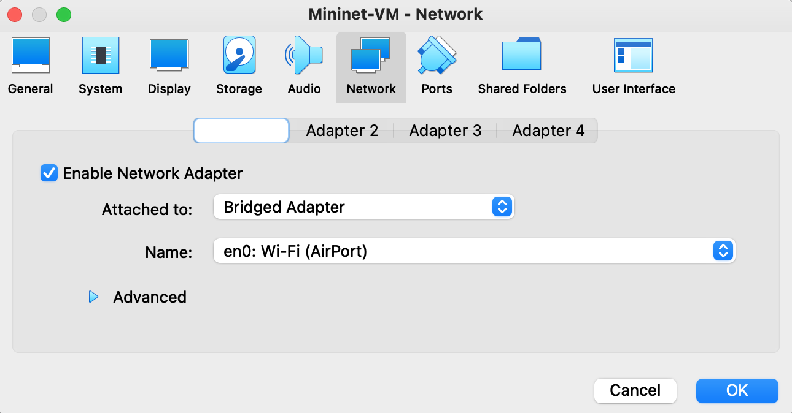

### Installing ONOS

The next step is to install ONOS. Start off by logging in on the Mininet VM (username: mininet, password: mininet). In this tutorial, we installed and used the newest available ONOS release version at the time, which was version 2.6.0 (Woodpecker).

#### Prerequisites

The [ONOS Requirements](https://wiki.onosproject.org/display/ONOS/Requirements) page tells us that our ONOS version requires Java 11.
```bash
sudo apt update
sudo apt install openjdk-11-jdk
```

We will also set the `$JAVA_HOME` variable, which should give us better performance.
```bash
sudo cat >> /etc/environment <<EOL
JAVA_HOME=/usr/lib/jvm/java-11-openjdk-amd64
EOL
```

#### Download and Run

Now that we have Java installed, we can proceed by downloading ONOS. The [ONOS Wiki](https://wiki.onosproject.org/display/ONOS/Installing+on+a+single+machine) has a nice page on how to install an ONOS production release onto your machine, so we will simply go over their steps.

Since ONOS's default packages assume ONOS gets installed under `/opt`, you should download and install the release there.
```bash
sudo mkdir /opt ; cd /opt
sudo wget -c https://repo1.maven.org/maven2/org/onosproject/onos-releases/2.6.0/onos-2.6.0.tar.gz
```

Once the tar archive is downloaded, untar the archive and rename the extracted directory to `onos`.
```bash
sudo tar -xvf onos-2.6.0.tar.gz
sudo mv onos-2.6.0 onos
```

At this point, you should be able to start the ONOS service to check if it works.
```bash
sudo /opt/onos/bin/onos-service start
```

## Introduction to ONOS

Once you have started the service, ONOS will make a bunch of functionalities available on the following ports (as mentioned in the [ONOS Requirements](https://wiki.onosproject.org/display/ONOS/Requirements)):

| Port | Functionality                |
| ---- | ---------------------------- |
| 8181 | REST API and GUI             |
| 8101 | access the ONOS CLI          |
| 9876 | intra-cluster communication  |
| 6653 | (optional) OpenFlow          |
| 6640 | (optional) OVSDB             |

In the next subsection, we will quickly cover how to access the user interfaces: The ONOS CLI and GUI/REST API.

### ONOS CLI and GUI

The CLI and GUI are the most important and useful interfaces for managing your networks. The CLI is the primary interface for configuring and managing different aspects of the running ONOS instance by means of executing commands. On the other hand, the GUI is a web application that provides a visual interface for your ONOS controller(s).

To get access to any of those interfaces, you will need login credentials. By default, ONOS comes with two "users":

| Username | Password |
| -------- | -------- |
| onos     | rocks    |
| karaf    | karaf    |

In a real-world scenario, you would obviously need to remove these default users and create a secure username-password combination, but for this tutorial we will simply use one of these users (usually *karaf*, but you are free to choose).

Next, we will learn how to access both of these interfaces. Make sure you have the ONOS instance running in one terminal window.
```bash
sudo /opt/onos/bin/onos-service start
```

#### Accessing the CLI

To access the CLI, you can run the following script.
```bash
sudo /opt/onos/bin/onos -l karaf
```

This bash script will start an SSH session that will start the command line client. The `-l` option is for providing one of the two users previously listed. Also provide the matching password when prompted.
<br>
If everything went well, you should be seeing the following window.
```
mininet@mininet-vm:/opt$ sudo /opt/onos/bin/onos -l karaf
Password authentication
Password:
Welcome to Open Network Operating System (ONOS)!
     ____  _  ______  ____
    / __ \/ |/ / __ \/ __/
   / /_/ /    / /_/ /\ \
   \____/_/|_/\____/___/

Documentation: wiki.onosproject.org
Tutorials:     tutorials.onosproject.org
Mailing lists: lists.onosproject.org

Come help out! Find out how at: contribute.onosproject.org

Hit '<tab>' for a list of available commands
and '[cmd] --help' for help on a specific command.
Hit '<ctrl-d>' or type 'logout' to exit ONOS session.

karaf@root >
```

#### Accessing the GUI

You can also access the GUI through a browser **on your host machine**. To do this, you can simply go to the URL `http://<onos-system-ip>:8181/onos/ui`, where `<onos-system-ip>` is the local IP address of your VM (The host is able to access the VM because of the network adapter that we put into "Bridged" mode). You can get the local IP of your guest OS as follows.
```
mininet@mininet-vm:~$ ifconfig | grep inet
        inet 192.168.0.239  netmask 255.255.255.0  broadcast 192.168.0.255
        inet 127.0.0.1  netmask 255.0.0.0
```

In this case, the local IP address of the system is `192.168.0.239`, so our URL would be `http://192.169.0.239:8181/onos/ui`. In your browser, you should now see the following screen.

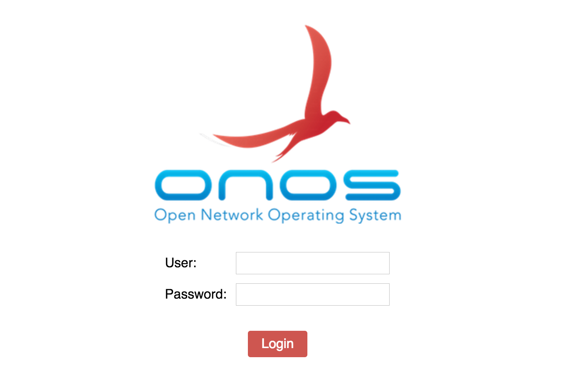

From here, you can log in with one of the two default users, after which you should be redirected to the Topology View.

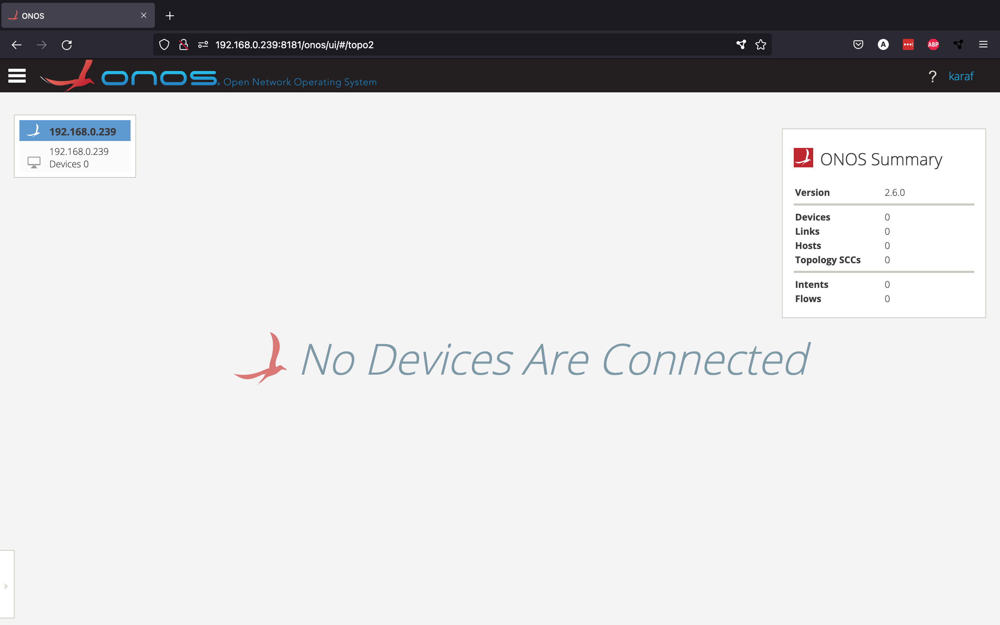

From here, you should normally be able to see an overview of the network topology that is currently connected to your controller(s), but since we haven't set up any network yet, so we don't see any devices.

## ONOS and Mininet

Mininet can be used to create virtual network topologies, which can then be controlled by an SDN controller like ONOS. Start by creating a simple Mininet topology by running the following command in a new terminal window.
```bash
sudo mn --topo tree,2,2 --mac --switch ovs,protocols=OpenFlow14  --controller remote,ip=192.168.0.239
```

Let's quickly go over the different options we provided:
* `--topo tree,2,2` creates a new tree topology with depth 2 and fanout 2
* `--mac` sets the host MAC and IP addresses to small and readable values
* `--switch ovs,protocols=OpenFlow14` tells Mininet to use Open vSwitches using OpenFlow version 14
* `--controller remote,ip=192.168.0.239` says that the switches will be controlled by a remote controller located on IP address `192.168.0.239` (which is the local IP of the Mininet VM)

Even though we have created a new topology, the network is still not showing up in the GUI. This is normal, since we haven't told ONOS yet that it should communicate with the switches using OpenFlow. We can do this by activating the pre-installed OpenFlow app through the ONOS CLI.
```
karaf@root > app activate org.onosproject.openflow
Activated org.onosproject.openflow
```

Now, our small Mininet topology should be showing up in the GUI.

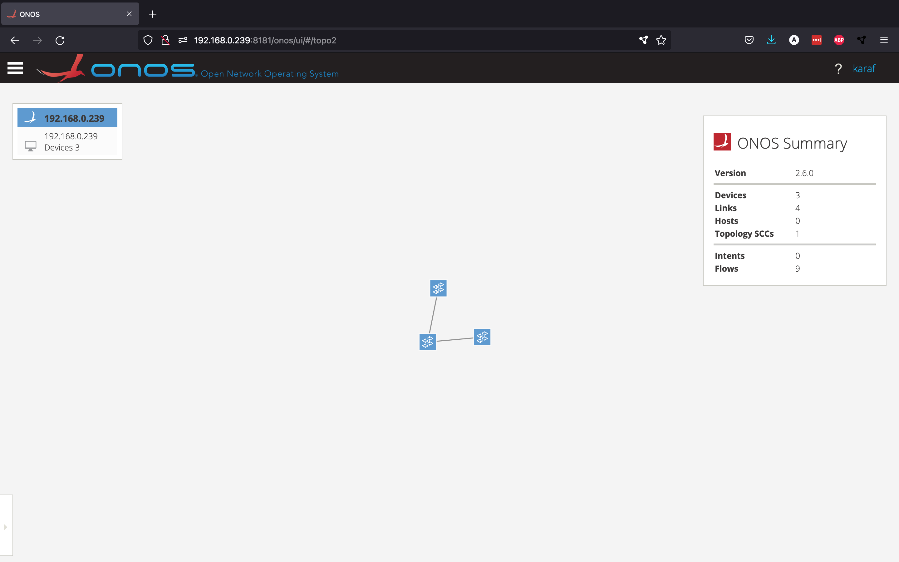

We can see that ONOS was able to discover the three switches that Mininet created. Pressing "h" should toggle the visibility of the host nodes, but ONOS hasn't discovered these hosts yet.
<br>
ONOS will only discover the different hosts once these hosts try to send data between them. This can be done by running the `pingall` command in Mininet, which will make all the hosts exchange data between themselves. and ONOS would become aware of their existence. However, if you try to run `pingall` right now, you will see that it fails.
```
mininet> pingall
*** Ping: testing ping reachability
h1 -> X X X
h2 -> X X X
h3 -> X X X
h4 -> X X X
*** Results: 100% dropped (0/12 received)
```

The reason for this is that, even though the controller is able to talk to the switches through OpenFlow, the controller has no idea what to do with the packets that the switch is receiving from the different hosts. The way we solve this is by activating the *reactive forwarding* app from ONOS.
```
karaf@root > app activate org.onosproject.fwd
Activated org.onosproject.fwd
```
This is a simple application that installs flows in response to every incoming packet arriving at the controller that didn't match a rule in the flow table on the switch

This is a simple application that installs flows on the switches. Every packet that arrives at a switch and doesn't have a match in the flow table gets sent to the controller. There, the `fwd` application will create a flow rule for that kind of packet and install it in the switch. Now the `pingall` command works as it should.
```
mininet> pingall
*** Ping: testing ping reachability
h1 -> h2 h3 h4
h2 -> h1 h3 h4
h3 -> h1 h2 h4
h4 -> h1 h2 h3
*** Results: 0% dropped (12/12 received)
```

If you go back to the GUI and toggle the visibility of the hosts, you should be able to see the four different hosts created by Mininet.

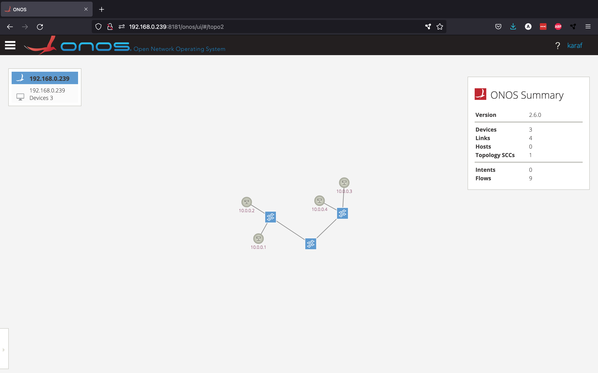

<!-- <figcaption align = "center" style="padding-bottom: 2rem"><small><b>Fig.1 - 4K Mountains Wallpaper</b></small></figcaption> -->

Now that we have introduced the ONOS CLI and GUI, as well as how to use the controller in combination with Mininet, we can move on to some simple examples.

## Example ONOS Use Cases

In this section, we will cover two use cases that could be useful on real networks. For the first use case, we will set up a layer 2 firewall to block traffic between certain hosts. In the second example, we will set up a Virtual Private LAN Service (VPLS).

### L2 Firewall

#### Introduction to ACL

We will be setting up a layer 2 firewall using the same Mininet topology as in the previous section. Luckily, we can easily set this up by taking advantage of a pre-installed ONOS application called `acl`. An ACL or Access Control List is a list containing rules that are used to filter network traffic. We will be creating rules to deny traffic between certain hosts. First, start by activating the application from the ONOS CLI.
```
karaf@root > app activate org.onosproject.acl
Activated org.onosproject.acl
```

This application exposes a REST API that allows us to add and remove rules and is available on http://192.168.0.239:8181/onos/v1/acl. If we look at the [source code](https://github.com/opennetworkinglab/onos/blob/onos-2.6/apps/acl/src/main/java/org/onosproject/acl/AclWebResource.java) for this application, we can derive the following API endpoints:

| Method  | Route       | Description           |
| ------- | ----------- | --------------------- |
| GET     | /rules      | Get all ACL rules     |
| POST    | /rules      | Add a new ACL rule    |
| DELETE  | /rules/{id} | Remove ACL rule       |
| DELETE  | /rules      | Remove all ACL rules  |

We can check to see if the REST API is active by requesting all current ACL rules. Since we haven't added any, we should get an empty response back, which is exactly what we get.


#### Firewall Implementation

Now that we know how to change the Access Control List, we can start using it to block traffic. Since it is not very convenient to manually send POST requests to block certain connections, we have decided to write a Python script that reads a csv file with MAC address pairs and blocks the traffic between them by creating ACL rules with these MAC addresses. You can find the full example in the *firewall* directory. This directory also contains the `firewall-policies.csv` file, which contains the MAC address pairs for which we would like to block traffic:

| id | mac_0             | mac_1             |
| -- | ----------------- | ----------------- |
| 1  | 00:00:00:00:00:01 | 00:00:00:00:00:04 |
| 2	 | 00:00:00:00:00:02 | 00:00:00:00:00:03 |
| 3	 | 00:00:00:00:00:03 | 00:00:00:00:00:07 |
| 4  | 00:00:00:00:00:06 | 00:00:00:00:00:05 |

We also have two Python files in that directory: `firewall.py` and `delete_firewall.py`. In `firewall.py`, we read all the MAC pairs from the csv file and send POST requests to the API to deny the traffic between them.
```python
import sys
import csv
import requests

# REST API url and headers
host = "192.168.0.239"
port = "8181"
username = "karaf"
password = "karaf"
url = f"http://{host}:{port}/onos/v1/acl/rules"
headers = {'Content-type': 'application/json'}

# read policy file
policyFile = "firewall-policies.csv"
firewall_rules = []
with open(policyFile, 'r') as csvfile:
    rows = csv.reader(csvfile, delimiter=',')
    line_count = 0
    for row in rows:
        if line_count == 0:
            line_count += 1
            continue
        firewall_rules.append((row[1], row[2]))
        line_count += 1

# put each firewall rule into the ACL using the REST API
for rule in firewall_rules:
    resp = requests.post(
        url,
        json={
            "srcIp": "10.0.0.0/24",
            "srcMac": rule[0],
            "dstMac": rule[1]
        },
        auth=(username, password)
    )
    print(resp.text)

```

If you would like to remove all the rules again, you can use the `delete_firewall.py` file. This code is pretty self-explanatory: it will remove all ACL rules by sending a DELETE request to the API.
```python
import requests

# REST API url and headers
host = "192.168.0.239"
port = "8181"
username = "karaf"
password = "karaf"
url = f"http://{host}:{port}/onos/v1/acl/rules"

# remove all rules from the ACL using the REST API
resp = requests.delete(url, auth=(username, password))
print(resp.text)

```

Once you run `firewall.py`, you can check whether the rules were properly added by sending another GET request. As you can see, there are a bunch of rules in the ACL now (one for every MAC pair).

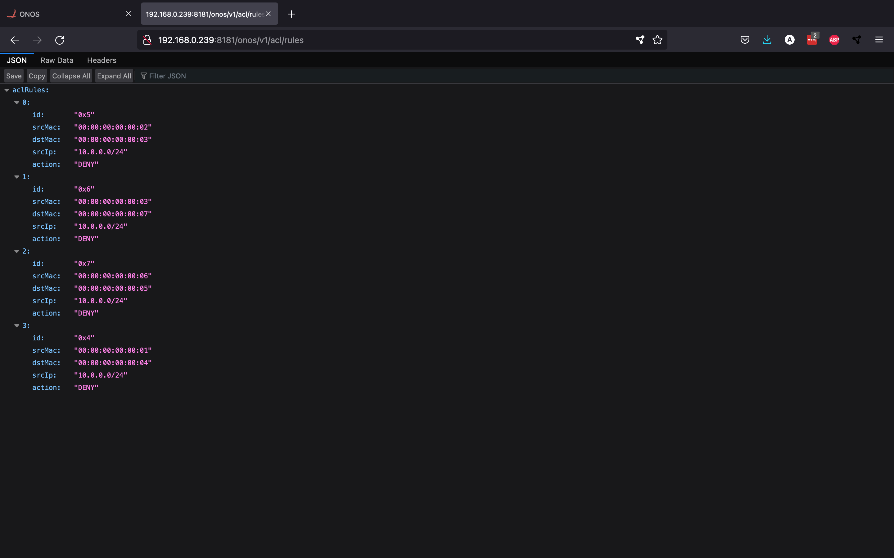

Furthermore, running the `pingall` command in Mininet will now block certain connections:
```
mininet> pingall
*** Ping: testing ping reachability
h1 -> h2 h3 X
h2 -> h1 X h4
h3 -> h1 X h4
h4 -> X h2 h3
*** Results: 33% dropped (8/12 received)
```

We can even use the GUI to look at the Flow View for a certain switch, which shows the different flow rules installed in it. In switch 2, we can see that the `acl` app converted the ACL rules to flow rules, which can then be enforced by the switch.

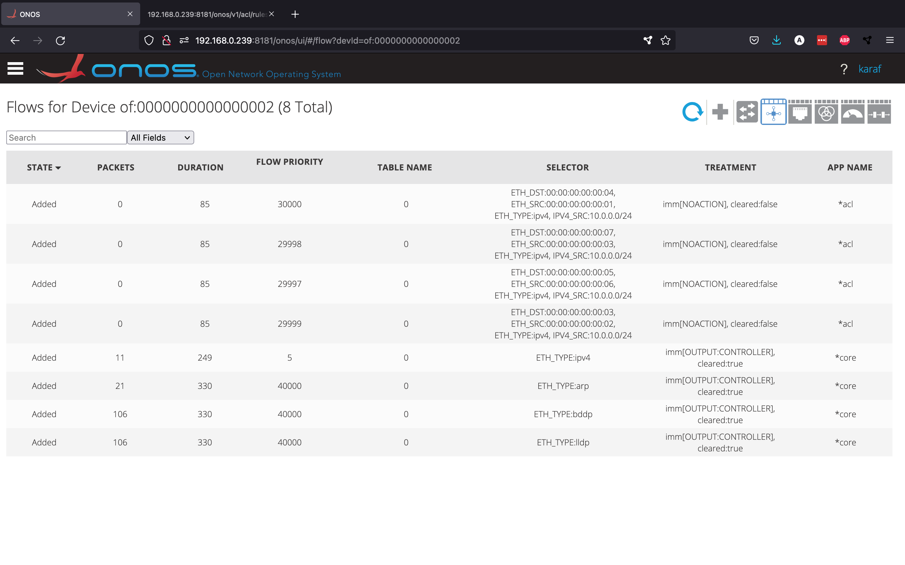

We have now successfully set up a L2 firewall.


### Virtual Private LAN Service (VPLS)
###### *Note: make sure that, if you followed along with the previous firewall example, you clear your ACL rules using the `delete_firewall.py` file and deactivate the `acl` app (to prevent interference with this example)*


In this section, we will look at a mora advanced use case for ONOS: we will set up a Virtual Private LAN service (VPLS). A VPLS is a multipoint-to-multipoint layer 2 Virtual Private Network (VPN) that allows geographically separated endpoints to share a L2 broadcast link, which makes it seem like the endpoints are on the same LAN. 

ONOS comes with a `vpls` application out of the box. Not only does this make it very easy to create, change and delete different VPLS networks whenever you want, it also allows the virtual LAN network to change dynamically over time. To understand how this works, we will first need to take a look at a more complex abstraction of ONOS called **intents**. 

#### Intents
ONOS has a subsystem that is called the Intent Framework. Intents allow specifying network behaviour in form of policies, rather than mechanisms. In short, this means that we will tell the network *what* to do, not *how* it should do it. To understand this better, let's look at a practical example of intents in ONOS.

Before we start, we will quickly set up ONOS and Mininet again. For ONOS, make sure you have the `org.onosproject.openflow` app activated. For Mininet, we will be using a larger and more complex topology called `torus`. You can create this topology as follows.
```bash
sudo mn -c
sudo mn --topo torus,3,3 --mac --switch ovs,protocols=OpenFlow14  --controller remote,ip=192.168.0.239
```

The topology looks as follows in the Topology View.


Since the reactive forwarding app `org.onosproject.fwd` is deactivated right now, we are unable to ping between any of the hosts. Let's assume we only want a single connection between host 10.0.0.1 and host 10.0.0.6 (we will call these h1 and h6 respectively). We can enable such a connection by creating a *host-to-host intent* from the ONOS CLI.
```
karaf@root > add-host-intent 00:00:00:00:00:01/None 00:00:00:00:00:06/None
Host to Host intent submitted:
HostToHostIntent{id=0x0, key=0x0, ...}
```

This intent can be visualised from the GUI by going to the *Intents* view from the side menu, selecting the intent and clicking *Show selected intent on topology view*. The intent is shown by an orange dotted line.

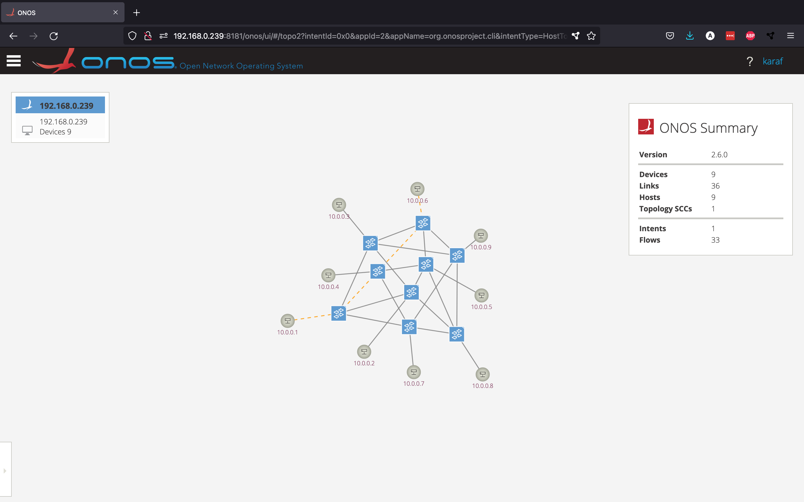

The above picture shows what route the intent has chosen to connect hosts h1 and h6. However, what would happen if one of these orange links were to go down? Let's find out. From the Mininet console, disable the link between the first two switches.
```
mininet> link s1x1 s2x1 down
```

Now, let's see what happened from the Topology View.

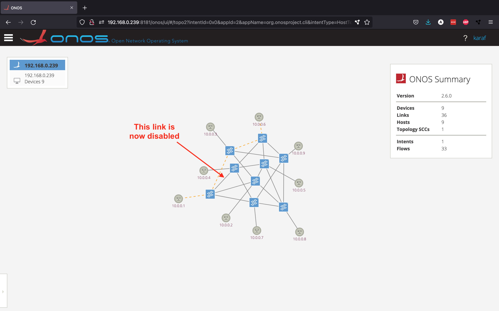

As you can see, this example shows how powerful intents are: the intent has decided to choose a new route, since the old one was not working anymore.

#### VPLS Implementation
The `vpls` app that comes with ONOS makes use of these intents: instead of specifying exactly what routes to take, the app will use intents to describe how the network should behave. It will do this by defining all broadcast and unicast connections between all hosts that should be part of the VPLS network. 
<br>
Let's go through an example where we try to set up a VPLS connection between hosts 10.0.0.1, 10.0.0.2 and 10.0.0.6 (h1, h2 and h6 respectively). 

###### *Note: For this demonstration, we disabled the `org.onosproject.gui2` app, which is the (default) second version of the GUI, and used version 1 called `org.onosproject.gui` instead. This is not necessary, but we did this because the first version allows us to show multiple intents at the same time in the Topology View.*

Let's start by activating the necessary apps.
```
karaf@root > app activate org.onosproject.vpls
Activated org.onosproject.vpls
```


To create a VPLS, we are required to define an interface for each host. We can also do this from the ONOS CLI.
```
karaf@root > interface-add of:0000000000000101/1 h1
Interface added
karaf@root > interface-add of:0000000000000102/1 h2
Interface added
karaf@root > interface-add of:0000000000000203/1 h6
Interface added
```

Next, we create a new VPLS named *vpls1* and add all the interfaces to it.
```
karaf@root > vpls create vpls1
karaf@root > vpls add-if vpls1 h1
karaf@root > vpls add-if vpls1 h2
karaf@root > vpls add-if vpls1 h6
```

Your VPLS should look like this now.
```
karaf@root > vpls show
----------------
VPLS name: vpls1
Associated interfaces: [h1, h2, h6]
Encapsulation: NONE
State: ADDED
----------------
```

If we go back to the GUI and look at the *Intents* view, we can see the new intents created by the `vpls` app.

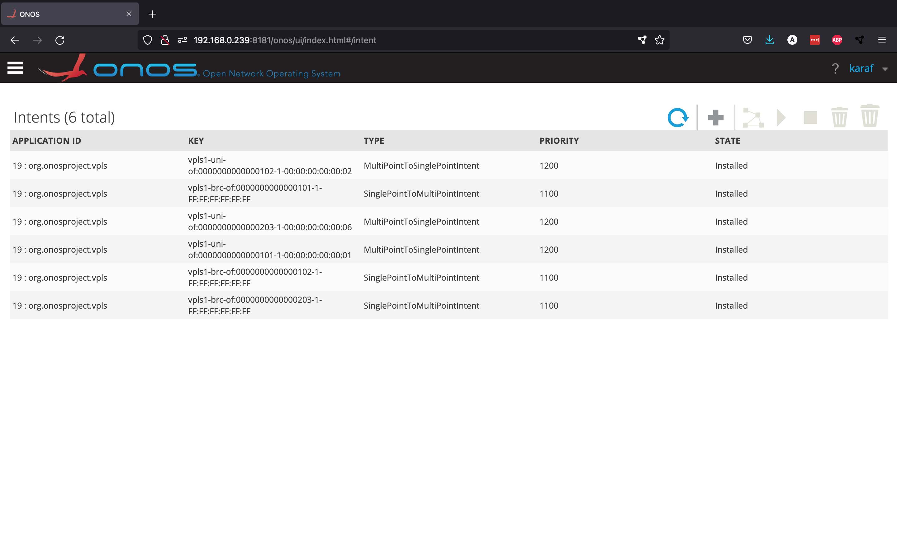

As you can see, there are three `SinglePointToMultiPointIntent`s, which represent the overlay networks for broadcast traffic, and three `MultiPointToSinglePointIntent`s, which represent the links for unicast traffic.

Using the first version of the GUI, we can visualise all the intents related to the virtual LAN network we just set up from the Topology View.

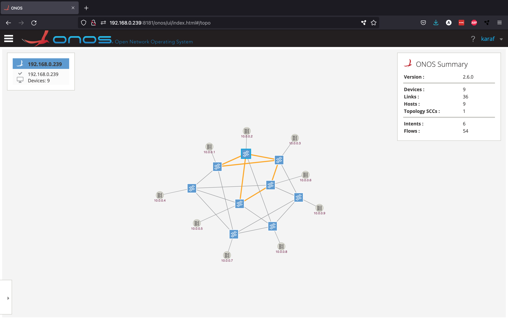

You should now be able to use the `ping` command between these three different hosts. Just like in the earlier intents example, let's "break" some links that are being used by this virtual network to see how the intent adapts.
```
mininet> link s1x3 s2x3 down
mininet> link s2x2 s2x3 down
```

The intents are now using different routes.

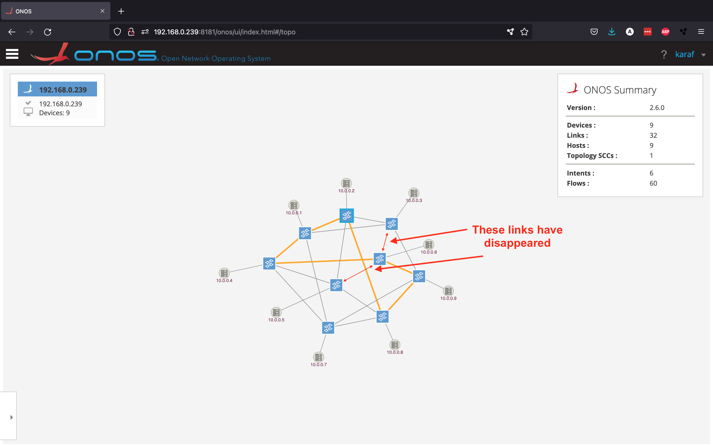

Even though the virtual network has changed routes quite drastically, you can still `ping` between all hosts, as if nothing has changed.
